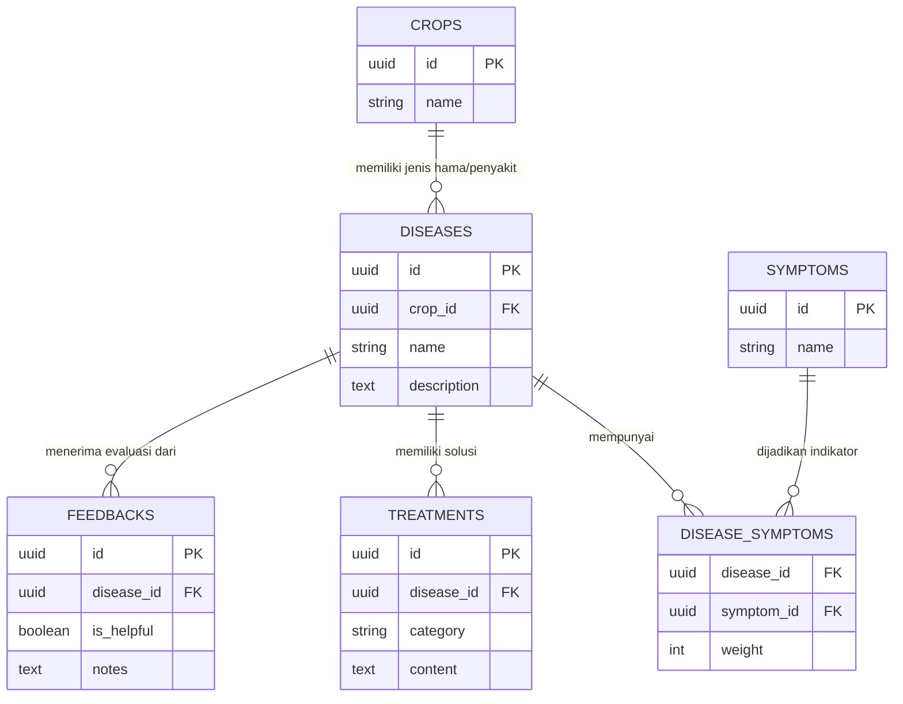

# PRD — Project Requirements Document

## 1. Overview
Petani cabai skala kecil sering kali menghadapi tantangan besar dalam mengidentifikasi penyakit atau hama tanaman secara akurat. Kesalahan diagnosis dapat menyebabkan gagal panen atau penggunaan bahan kimia yang berlebihan dan tidak efisien. **Agri-Assist** hadir sebagai aplikasi berbasis web yang berfungsi sebagai alat bantu keputusan (*decision support tool*) yang cepat dan mudah digunakan. Melalui sistem diagnosis berbasis aturan (*rule-based*) yang sederhana, petani cukup memilih gejala yang terlihat pada tanaman melalui *checklist* atau input teks. Aplikasi kemudian akan menganalisis kemungkinan penyakit berdasarkan literatur pertanian terpercaya dan memberikan rekomendasi penanganan yang praktis. Aplikasi ini adalah langkah awal yang dirancang sedemikian rupa agar di masa depan dapat diekspansi menjadi sistem pertanian cerdas berbasis AI (Deteksi Gambar). **Agri-Assist** tidak hanya menyediakan informasi penyakit, tetapi berfungsi sebagai sistem yang mengubah observasi lapangan menjadi keputusan tindakan yang terstruktur.

## 2. Requirements
- **Target Pengguna:** Petani skala kecil, khususnya petani cabai, yang membutuhkan antarmuka yang sangat intuitif dan tidak membingungkan.
- **Konektivitas:** Aplikasi berjalan secara *Online Saja* untuk memastikan database penyakit dan rekomendasi selalu versi terbaru.
- **Metode Input:** Pengguna berinteraksi melalui *Checklist* (centang gejala yang terlihat) dan *Input Teks* (pencarian gejala).
- **Sumber Data:** Sistem *rule-based* dibangun menggunakan data dari Kementerian Pertanian RI, jurnal agrikultur, dan praktisi lapangan.
- **Kesiapan Masa Depan:** Arsitektur harus modular agar fitur "Deteksi Gambar melalui AI" dapat ditambahkan di fase pengembangan berikutnya tanpa merombak sistem dasar.

## 3. Core Features
- **Pemilihan Gejala Interaktif:** Halaman formulir sederhana di mana petani dapat mencari atau mencentang gejala fisik yang dialami tanaman cabainya (misal: daun menguning, bercak hitam, batang layu).
- **Mesin Diagnosis Otomatis (*Rule-Based Engine*):** Sistem di belakang layar yang mencocokkan kombinasi gejala yang dipilih petani dengan database penyakit untuk menentukan diagnosis yang paling akurat.
- **Rekomendasi Penanganan 4 Pilar:** Hasil diagnosis yang menampilkan langkah tindakan yang dikategorikan dengan jelas menjadi:
  1. Penanganan Alami
  2. Langkah Pencegahan
  3. Penggunaan Pupuk Organik
  4. Penggunaan Obat Kimia (sebagai opsi terkalkulasi)
- **Sistem *Feedback* Pengguna:** Fitur sederhana bagi petani untuk memberikan umpan balik (misalnya tombol "Sangat Membantu" / "Kurang Sesuai") untuk penyempurnaan akurasi data di masa depan.
- Sistem menggunakan pendekatan scoring berbasis bobot gejala, di mana setiap kecocokan gejala akan menambah skor suatu penyakit, dan hasil akhir akan diurutkan berdasarkan skor tertinggi.

### 3.1 Logic & Scoring Engine
Untuk memastikan akurasi diagnosis, sistem menggunakan metode **Weighted Score** dengan mekanisme perhitungan sebagai berikut:

1.  **Penjumlahan Weight (Sum Weight):** 
    - Sistem menjumlahkan nilai `weight` dari semua gejala yang dipilih oleh pengguna yang terkait dengan suatu penyakit tertentu.
    - Rumus: `Score_Mentah = Σ.weight(gejala_dipilih)`
2.  **Normalisasi Skor:** 
    - Skor mentah dinormalisasi berdasarkan total bobot maksimum yang mungkin dimiliki oleh penyakit tersebut (total weight dari semua gejala yang terdaftar untuk penyakit itu).
    - Rumus: `Skor_Akhir = Score_Mentah / Total_weight_Penyakit`
3.  **Threshold Diagnosis:** 
    - Hasil diagnosis hanya akan ditampilkan kepada pengguna jika `Skor_Akhir` melebihi ambang batas tertentu.
    - Ketentuan: Diagnosis ditampilkan jika `Skor_Akhir > 0.6` (60%). Jika di bawah threshold, sistem akan menyatakan "Tidak ada diagnosis yang cukup yakin" dan menyarankan konsultasi lanjutan.
    - Jika tidak ada penyakit yang melewati threshold, sistem tetap menampilkan 1–2 kemungkinan tertinggi dengan label “Kemungkinan rendah”, serta menyarankan konsultasi lanjutan.

## 4. User Flow
1. **Buka Aplikasi:** Petani membuka aplikasi Agri-Assist melalui *browser* di *smartphone* mereka.
2. **Pilih Gejala:** Petani melihat daftar gejala umum dan mencentang gejala yang sesuai dengan kondisi tanaman cabainya (atau mengetik gejala di kolom pencarian).
3. **Proses Analisis:** Petani menekan tombol "Diagnosis". Aplikasi mengirimkan data ke peladen (*server*) untuk dianalisis.
4. **Terima Hasil & Rekomendasi:** Layar menampilkan nama kemungkinan penyakit/hama dan memaparkan 4 pilar rekomendasi penanganan dengan bahasa yang mudah dipahami. Tampilkan 2–3 kemungkinan penyakit (bukan 1 saja).
5. **Berikan *Feedback*:** Di akhir halaman rincian, petani menekan tombol *feedback* terhadap hasil diagnosis yang diberikan.

## 5. Architecture
Aplikasi ini menggunakan pendekatan *Client-Server* modern. Antarmuka pengguna akan dilayani oleh *Frontend* yang cepat dan responsif, sementara logika pencocokan penyakit (*rule-based*) akan ditangani sepenuhnya oleh *Backend* untuk menjaga keamanan data dan mempermudah pembaruan aturan di masa depan. Backend mengelola seluruh logika diagnosis untuk memastikan aturan dapat diperbarui tanpa perlu perubahan di sisi frontend.

```mermaid
flowchart TD
    User([👨‍🌾 Petani]) -->|Akses Aplikasi & Pilih Gejala| FE[Frontend: Next.js]
    FE -->|Kirim Data Gejala (API Request)| BE[Backend API: Golang]
    
    subgraph Server Back-End
        BE -->|Query Pencocokan Aturan| DB[(Database: PostgreSQL)]
        DB -->|Kembalikan Data Penyakit & Solusi| BE
    end
    
    BE -->|Kirim Hasil Diagnosis (JSON)| FE
    FE -->|Tampilkan UX/UI Hasil| User
    
    subgraph External
        Deploy[Hosting: Vercel] -.->|Menghosting| FE
    end
```

## 6. Database Schema
Untuk menjalankan sistem *rule-based* yang *scalable*, kita membutuhkan relasi antara Tanaman (*Crops*), Gejala (*Symptoms*), Penyakit (*Diseases*), dan Penanganan (*Treatments*).

**Daftar Tabel Utama:**
1. **`crops` (Tanaman):** Menyimpan daftar jenis tanaman yang didukung sistem.
   - `id` (UUID) - Primary Key
   - `name` (String) - Nama tanaman (misal: Cabai, Tomat, Padi)
2. **`diseases` (Penyakit):** Menyimpan daftar penyakit spesifik untuk setiap tanaman.
   - `id` (UUID) - Primary Key
   - `crop_id` (UUID) - Foreign Key ke crops (mengidentifikasi tanaman pemilik penyakit)
   - `name` (String) - Nama penyakit (misal: Patek/Antraknosa)
   - `description` (Text) - Penjelasan singkat
3. **`symptoms` (Gejala):** Menyimpan daftar gejala fisik.
   - `id` (UUID) - Primary Key
   - `name` (String) - Nama gejala (misal: Bercak coklat melingkar)
   - `category` (string) - kategori gejala (misal: daun, batang, buah)
4. **`disease_symptoms` (Relasi Aturan):** Penghubung antara penyakit dan gejalanya (Aturan / *Rules*).
   - `disease_id` (UUID) - Foreign Key ke diseases
   - `symptom_id` (UUID) - Foreign Key ke symptoms
   - `weight` (Integer) - Bobot gejala untuk prioritas diagnosis
5. **`treatments` (Penanganan):** Berisi rekomendasi tindakan.
   - `id` (UUID) - Primary Key
   - `disease_id` (UUID) - Foreign Key ke diseases
   - `category` (String) - Kategori (Alami, Pencegahan, Organik, Kimia)
   - `content` (Text) - Penjelasan detail tindakan
6. **`feedbacks` (Umpan Balik):** Menyimpan riwayat dan penilaian agar sistem bisa dievaluasi.
   - `id` (UUID) - Primary Key
   - `disease_id` (UUID) - Penyakit yang didiagnosis
   - `is_helpful` (Boolean) - Apakah rekomendasi membantu
   - `notes` (Text) - Catatan tambahan (opsional)



## 7. Tech Stack
Berikut adalah susunan teknologi yang akan digunakan untuk memenuhi kebutuhan komputasi cepat, arsitektur kokoh, dan pengalaman pengguna yang lancar:
- **Frontend / Antarmuka Pengguna Utama:** **Next.js** (Framework React). Dipilih karena performanya yang cepat dan ramah SEO.
- **Tampilan & Desain (UI/UX):** **Tailwind CSS** dipadukan dengan **shadcn/ui**. Memungkinkan pembuatan antarmuka yang rapi, berfokus pada layar *mobile* (mengingat petani menggunakan HP), dan cepat dikembangkan.
- **Backend / Logika Sistem:** **Go (Golang)**. Sangat cepat, ringan, dan stabil untuk memproses *rule-based engine*, memastikan petani mendapatkan hasil seketika walau di koneksi terbatas. Arsitektur BE menggunakan hexagonal architecture sederhana, framework go echo, dan gorm.
- **Database Utama:** **PostgreSQL**. Database relasional yang sangat kuat, ideal untuk menghubungkan relasi kompleks antara gejala, penyakit, dan penanganan.
- **Deployment:** 
  - Bagian Frontend akan di-*deploy* menggunakan **Vercel** untuk kemudahan CI/CD.
  - *(Opsional/Rekomendasi)*: Bagian Backend Go dan PostgreSQL dapat di-*deploy* di layanan seperti Railway, Render, atau penyedia *cloud* lain yang kompatibel.

## 8. Out of Scope
- Tidak mendukung image detection
- Tidak mendukung offline mode
- Fokus hanya pada tanaman cabai